# EV Smart Route & Charging Assistant — Class Diagram

This document contains the class diagram for the EV Smart Route & Charging Assistant project, detailing the relationships between users, stations, and booking entities.

```mermaid
classDiagram
    class User {
        +int id
        +string username
        +string email
        +string role
        +boolean is_verified
        +datetime created_at
        +login()
        +register()
        +updateProfile()
    }

    class Owner {
        +list stations
        +verifyStation()
        +manageBookings()
    }

    class Admin {
        +list all_users
        +list all_stations
        +approveOwner()
        +viewAnalytics()
    }

    class ChargingStation {
        +int id
        +string name
        +string address
        +string city
        +string connector_type
        +float power_kw
        +string availability
        +boolean is_verified
        +int owner_id
        +getLiveStatus()
        +calculateWaitTime()
    }

    class Connector {
        +int id
        +int station_id
        +string type
        +float power
        +float price_per_kwh
        +string status
    }

    class Booking {
        +int id
        +int station_id
        +int user_id
        +datetime start_time
        +datetime end_time
        +string status
        +float total_price
        +cancel()
        +complete()
    }

    class Vehicle {
        +int id
        +int user_id
        +string name
        +float battery_capacity
        +float efficiency
    }

    class StationReview {
        +int id
        +string station_id
        +int user_id
        +int rating
        +string comment
    }

    class UsageEvent {
        +int id
        +int user_id
        +string event_type
        +datetime created_at
    }

    User <|-- Owner : Inheritance
    User <|-- Admin : Inheritance
    
    User "1" -- "*" Booking : makes
    User "1" -- "*" Vehicle : owns
    User "1" -- "*" StationReview : writes
    
    Owner "1" -- "*" ChargingStation : manages
    
    ChargingStation "1" -- "*" Connector : contains
    ChargingStation "1" -- "*" Booking : hosts
    ChargingStation "1" -- "*" StationReview : receives
    
    User "1" -- "*" UsageEvent : triggers
```

## Description of Entities

### 1. User System
*   **User**: The base entity for all accounts. Handles core authentication.
*   **Owner**: A specialized user who can add and manage charging stations.
*   **Admin**: A super-user with platform-wide visibility and approval authority.

### 2. Infrastructure
*   **ChargingStation**: Represents a physical location with EV chargers. Tracks verification status and owner.
*   **Connector**: Individual charging ports at a station. Different connectors can have different speeds (kW) and prices.

### 3. Core Activity
*   **Booking**: The central transaction of the app. Connects a user to a station for a specific time window.
*   **StationReview**: User feedback mechanism to maintain quality and trust.

### 4. Personalization & Analytics
*   **Vehicle**: User's EV details used to calculate ranges and charging costs.
*   **UsageEvent**: Tracks high-level feature usage (like route planning) for administrative insights.
