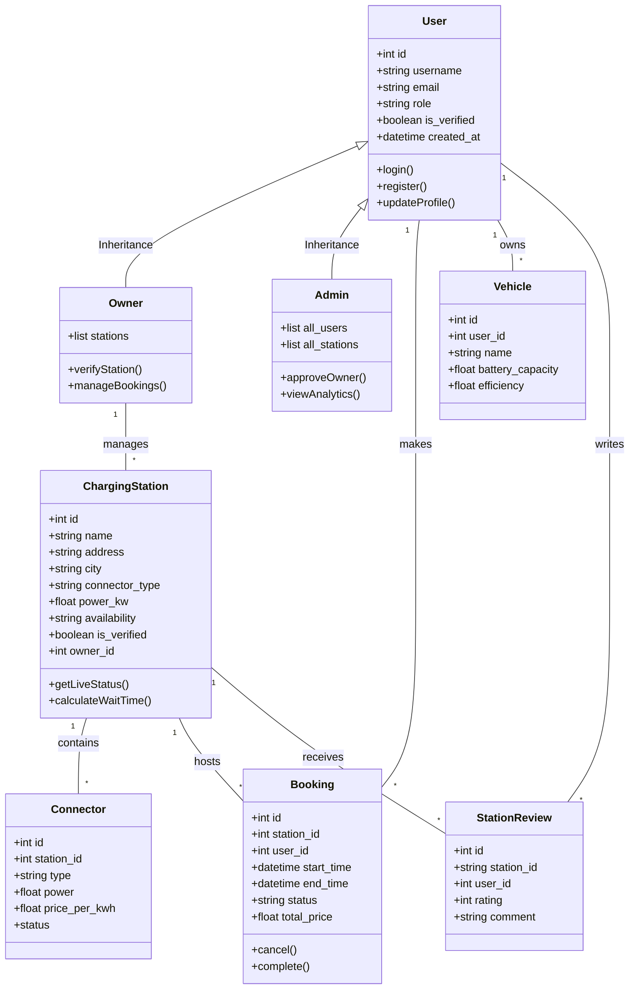
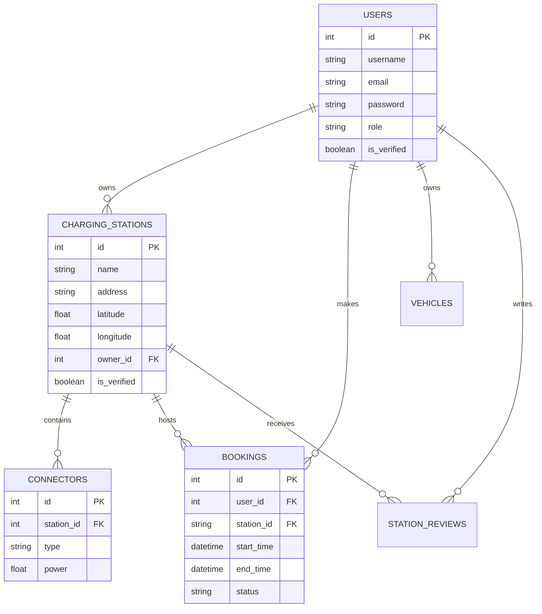
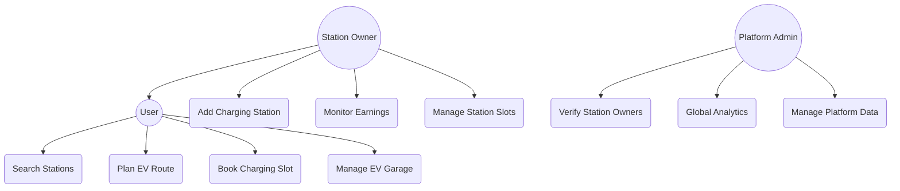
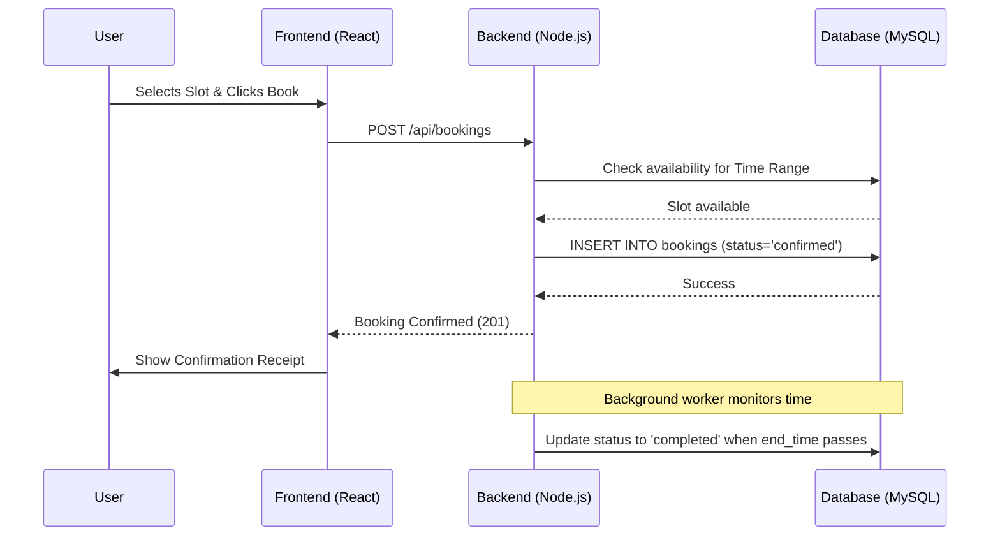

# EV Smart Route & Charging Assistant — Complete Technical Documentation

This document provides a full overview of the project architecture, including class structures, database relationships, and core workflows.

---

## 1. Class Diagram (System Architecture)
Visualizes the object-oriented structure and inheritance patterns.

---

## 2. Entity Relationship Diagram (Database Schema)
Shows how data is stored and linked in MySQL.

---

## 3. Use Case Diagram (User Roles)
Defines what each user role can perform within the system.

---

## 4. Sequence Diagram (Core Booking Flow)
The lifecycle of a charging session booking.

