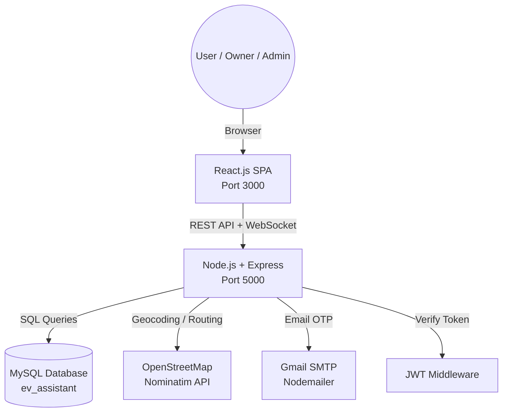

# ⚡ EV Smart Route & Charging Assistant

> **MCA Final Year Project** — Solving EV Range Anxiety through Intelligent Route Planning, Real-Time Charging Station Management, and Slot Booking.

[](https://reactjs.org/)
[](https://nodejs.org/)
[](https://expressjs.com/)
[](https://www.mysql.com/)
[](https://jwt.io/)
[](https://www.openstreetmap.org/)

---

## 🚀 1. Project Overview

### The Problem — Range Anxiety
**Range Anxiety** is the #1 barrier to EV adoption. Drivers fear their battery will run out before reaching their destination, especially on long trips where charging infrastructure is unfamiliar or hard to find.

### The Solution
**EV Smart Route & Charging Assistant** is a full-stack web platform that eliminates range anxiety by helping EV drivers plan smarter trips. It combines real-time station data, an interactive map, an intelligent route feasibility engine, and a booking system — all in one place.

| Who it helps | How |
|---|---|
| 🧑 EV Drivers | Plan routes, spot chargers on the map, book slots in advance |
| 🏢 Station Owners | Register stations, manage availability, track bookings & revenue |
| 🔑 Admins | Verify stations & owners, moderate the platform, view analytics |

---

## ✨ 2. Features

### 🔋 Core User Features
- **Battery Range Calculator** — Enter battery capacity, efficiency, and charge level to get an estimated range in km
- **Route Feasibility Check** — Enter origin & destination; the system tells you if the trip is possible and suggests charging stops if not
- **Multi-Stop Journey Planner** — Plan complex routes with multiple waypoints across verified charging stations
- **Charging Station Finder** — Interactive map powered by OpenStreetMap; filter by connector type, power output, and distance
- **Slot Booking System** — Book a charging time slot at a station with real-time availability tracking
- **My Bookings** — View, track, and cancel upcoming and past sessions
- **EV Garage** — Save your vehicle's specs (battery, efficiency) for quick calculations
- **OTP-Based Security** — Email OTP verification for password and email changes

### 🏢 Station Owner Features
- Add, edit, and manage charging stations with connector types, power output, and pricing
- Toggle station availability (Active / Maintenance / Offline)
- View all bookings made at their stations with revenue tracking
- See customer reviews and ratings per station

### 🔑 Admin Features
- Verify / unverify station owner accounts
- Approve or reject charging station listings
- View platform-wide analytics (users, owners, stations, revenue trends)
- Moderate user accounts and station reviews

---

## 🏗️ 3. System Architecture



### Layer Responsibilities
| Layer | Technology | Role |
|---|---|---|
| **Frontend** | React.js, CSS | SPA — UI rendering, state management, API calls |
| **Backend** | Node.js, Express.js | REST API, business logic, WebSocket for live station status |
| **Database** | MySQL (`mysql2`) | Persistent storage — users, stations, bookings, reviews |
| **Auth** | JSON Web Tokens | Stateless authentication with role-based access control |
| **Maps** | OpenStreetMap / Nominatim | Address geocoding and route distance calculations |
| **Email** | Nodemailer + Gmail SMTP | OTP delivery for password/email changes and reset |

---

## 🧠 4. Algorithms Used

### 📐 Haversine Formula
Calculates the shortest distance between two GPS coordinates on the Earth's surface.

```
a = sin²(Δlat/2) + cos(lat1) × cos(lat2) × sin²(Δlon/2)
distance = 2 × R × atan2(√a, √(1−a))       where R = 6371 km
```

**Applied in:**
- Finding charging stations within a user-defined radius
- Calculating if a route distance is within the vehicle's current range
- Sorting stations by proximity in the map view

### ⚙️ Route Feasibility Logic
```javascript
const rangeKm = (batteryPercent / 100) * batteryCapacityKwh / efficiencyKwhPerKm;
const isFeasible = rangeKm >= routeDistanceKm;

if (!isFeasible) {
  // Trigger station suggestion — find stations reachable along the route
}
```

---

## 👥 5. User Roles & Access

| Role | Registration | Verification | Key Capabilities |
| :--- | :--- | :--- | :--- |
| **👤 User** | Self-register | Auto-verified | Route planning, booking, EV garage |
| **🏠 Owner** | Self-register | Admin must approve | Station management, revenue dashboard |
| **🔑 Admin** | Seeded by system | N/A | Full platform control |

---

## 📊 6. Database Schema (MySQL)

### Tables Overview

| Table | Purpose |
| :--- | :--- |
| `users` | All accounts — users, owners, and admins |
| `charging_stations` | Owner-registered EV charging hubs |
| `connectors` | Individual charging ports per station |
| `bookings` | Slot reservations by users at stations |
| `vehicles` | User's saved EV specs |
| `station_reviews` | Ratings and comments per station |
| `password_resets` | Tokens for forgot-password flow |
| `password_change_otps` | OTPs for authenticated password changes |
| `email_change_otps` | OTPs for authenticated email changes |
| `usage_events` | Lightweight analytics (route planner usage) |

> 📄 Full schema: [`backend/schema.sql`](./backend/schema.sql)

---

## ⚙️ 7. Installation & Setup

### Prerequisites
| Tool | Version |
|---|---|
| Node.js | v16+ |
| npm | v8+ |
| MySQL | v8+ (XAMPP / WAMP / native) |

---

### Step 1 — Clone the Repository
```bash
git clone https://github.com/yourusername/ev-smart-assistant.git
cd ev-smart-assistant
```

### Step 2 — Install All Dependencies
```bash
npm run install-all
```
This installs packages for the root, backend, and frontend in one command.

### Step 3 — Create the MySQL Database
Open MySQL (phpMyAdmin / CLI) and create the database:
```sql
CREATE DATABASE ev_assistant;
```

### Step 4 — Configure Environment Variables
Create `backend/.env` (copy from `.env.example` if provided):
```env
# Server
PORT=5000

# MySQL Database
DB_HOST=localhost
DB_PORT=3306
DB_USER=root
DB_PASSWORD=
DB_NAME=ev_assistant

# Startup — auto-creates all tables on first run
DB_BOOTSTRAP=true
DB_SEED_ADMIN=true

# Security — change this in production!
JWT_SECRET=your-super-secret-jwt-key

# Email (Gmail App Password — for OTPs and password reset)
MAIL_USER=your_email@gmail.com
MAIL_PASS=your_gmail_app_password
```

### Step 5 — Run the Application
```bash
# Starts both backend (port 5000) and frontend (port 3000) together
npm run dev
```

### Utility Scripts
```bash
# Run database migrations (adds new columns/tables safely)
cd backend && npm run migrate

# Reset or create the default admin account
cd backend && npm run reset-admin
```

### Default Admin Credentials
After first run (with `DB_SEED_ADMIN=true`):
- **Email:** `admin@evassistant.com`
- **Password:** `Admin@123`

> ⚠️ Change these immediately after first login.

---

## 📁 8. Project Structure

```
ev-smart-assistant/
│
├── frontend/                  # React.js SPA
│   └── src/
│       ├── components/        # Reusable UI components (Navbar, Modals)
│       ├── context/           # AuthContext (global auth state)
│       └── pages/             # Route-level pages (Home, Dashboard, Stations…)
│
├── backend/                   # Node.js + Express REST API
│   ├── config/
│   │   └── database.js        # MySQL pool & query helper
│   ├── middleware/
│   │   └── auth.js            # JWT authentication & role authorization
│   ├── routes/
│   │   ├── auth.js            # Register, login, OTP, password reset
│   │   ├── stations.js        # Station CRUD, search, reviews
│   │   ├── bookings.js        # Booking creation & management
│   │   ├── admin.js           # Admin-only moderation APIs
│   │   ├── vehicles.js        # User vehicle garage
│   │   └── calculator.js      # Range calculator & route feasibility
│   ├── schema.sql             # Full MySQL database schema
│   ├── migrate.js             # Database migration utility
│   ├── reset_admin.js         # Admin account seeder
│   └── server.js              # App entry point + WebSocket server
│
├── .gitignore
├── package.json               # Root scripts (dev, install-all)
└── README.md
```

---

## 🔮 9. Future Enhancements

- **🧠 AI Route Optimization** — Use ML to predict traffic & weather impact on battery drain
- **📡 IoT Integration** — Live station status from real hardware sensors
- **💳 Payment Gateway** — UPI / Stripe integration for seamless checkout
- **📱 Mobile App** — React Native / Flutter companion app
- **🌐 Multi-Language Support** — Hindi and regional language UI

---

## 🎓 10. Academic Value (MCA Final Year)

This project demonstrates a wide range of skills relevant to a Master of Computer Applications degree:

| Domain | Implementation |
|---|---|
| **Full-Stack Development** | React.js frontend + Node.js/Express backend + MySQL |
| **Database Design** | Normalized relational schema with foreign keys and constraints |
| **Algorithms** | Haversine formula for geospatial distance calculation |
| **System Security** | JWT auth, OTP verification, bcrypt password hashing, CORS |
| **API Design** | RESTful endpoints with role-based middleware guards |
| **Real-Time Systems** | WebSocket-based live station status updates |
| **Third-Party APIs** | OpenStreetMap Nominatim for geocoding |
| **Software Engineering** | Modular code structure, `.env` separation of concerns |

---

## 📜 11. License

Distributed under the **MIT License**. See `LICENSE` for more information.

---

<div align="center">
  <strong>Developed with ❤️ for MCA Final Year Project Submission — 2026</strong><br/>
  <em>EV Smart Route & Charging Assistant</em>
</div>
