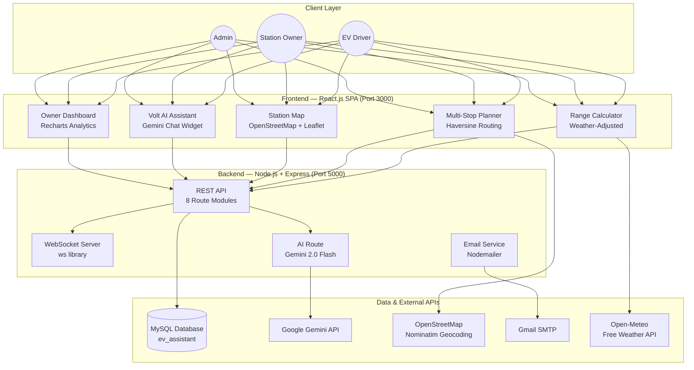

# ⚡ EV Smart Route & Charging Assistant

<div align="center">

**A full-stack, production-grade platform that eliminates EV range anxiety through AI-powered route planning, real-time charging station management, and intelligent slot booking.**

[](https://reactjs.org/)
[](https://nodejs.org/)
[](https://www.mysql.com/)
[-010101?style=flat-square&logo=socketdotio)](https://www.npmjs.com/package/ws)
[](https://ai.google.dev/)
[](./LICENSE)

[Features](#-features) · [Architecture](#-system-architecture) · [AI Assistant](#-ai-assistant-volt) · [Setup](#-installation--setup) · [API Reference](#-api-reference)

</div>

---

## 🚀 Project Overview

### The Problem — Range Anxiety
**Range Anxiety** is the #1 barrier to EV adoption globally. Drivers fear running out of battery before reaching their destination — especially on long trips where charging infrastructure is unfamiliar. This problem is compounded by:
- Unpredictable battery drain due to temperature, traffic, and driving behavior
- Fragmented, unreliable charging station data
- No intelligent multi-stop planning tools for India's highway network

### The Solution
**EV Smart Route & Charging Assistant** is a comprehensive web platform that solves this problem through five interconnected systems:

| System | What it does |
|---|---|
| 🧠 **AI Route Brain** | Predicts feasibility of any trip using Haversine + efficiency adjustment algorithms |
| ⚡ **Live Station Network** | Real-time WebSocket-powered station availability across verified Indian charging hubs |
| 🤖 **Volt AI Assistant** | Conversational Gemini 2.0-powered chatbot for trip planning and EV guidance |
| 📧 **Smart Notifications** | Automatic email confirmations and owner alerts on every booking event |
| 🌡️ **Weather Intelligence** | Battery range estimates auto-adjusted for live temperature conditions |

---

## ✨ Features

### 🧑 EV Driver
| Feature | Description |
|---|---|
| **Battery Range Calculator** | Enter capacity, charge %, and driving style → get real-time range estimate with weather penalty |
| **Route Feasibility Check** | Point-A to Point-B analysis with charging stop recommendations if battery is insufficient |
| **Multi-Stop Journey Planner** | Plan complex cross-city routes (e.g., Ahmedabad → Udaipur → Jaipur) with automatic charging optimization |
| **Charging Station Finder** | Interactive OpenStreetMap with filters: connector type, power output, distance, and live availability |
| **Slot Booking System** | Book a charging time slot with conflict detection and real-time calendar view |
| **My Bookings** | Full session history with live status (confirmed / completed / cancelled) |
| **EV Garage** | Save vehicle specs (battery kWh, efficiency) for one-click pre-fill across all tools |
| **Volt AI Chat** | Ask "Plan Ahmedabad to Mumbai" or "how much range at 60%?" — get instant AI answers |

### 🏢 Station Owner
| Feature | Description |
|---|---|
| **Command Center Dashboard** | Revenue trends (Recharts area/bar charts), booking counts, station network KPIs |
| **Real-Time Booking Alerts** | Live WebSocket toast notification when a new booking arrives — no refresh needed |
| **Email Notifications** | Instant email alerts to owner on every new booking at their stations |
| **Station CRUD** | Add/edit stations with connectors, pricing, power output, and availability status |
| **Revenue Analytics** | 14-day usage and revenue charts with daily breakdown |

### 🔑 Admin
| Feature | Description |
|---|---|
| **Owner Verification** | Approve/reject owner accounts before they can list stations |
| **Station Moderation** | Verify, unverify, or remove station listings platform-wide |
| **Platform Analytics** | Global view of users, owners, stations, and revenue trends |

---

## 🏗️ System Architecture


```mermaid
graph TD
    subgraph "Client Layer"
        U((EV Driver))
        O((Station Owner))
        A((Admin))
    end

    subgraph "Frontend — React.js SPA (Port 3000)"
        RC[Range Calculator\nWeather-Adjusted]
        MSP[Multi-Stop Planner\nHaversine Routing]
        MAP[Station Map\nOpenStreetMap + Leaflet]
        VOLT[Volt AI Assistant\nGemini Chat Widget]
        OWN[Owner Dashboard\nRecharts Analytics]
    end

    subgraph "Backend — Node.js + Express (Port 5000)"
        REST[REST API\n8 Route Modules]
        WS[WebSocket Server\nws library]
        AI[AI Route\nGemini 2.0 Flash]
        EMAIL[Email Service\nNodemailer]
    end

    subgraph "Data & External APIs"
        DB[(MySQL Database\nev_assistant)]
        GEM[Google Gemini API]
        OSM[OpenStreetMap\nNominatim Geocoding]
        SMTP[Gmail SMTP]
        WEATHER[Open-Meteo\nFree Weather API]
    end

    U & O & A --> RC & MSP & MAP & VOLT & OWN
    RC & MSP & MAP & VOLT & OWN --> REST
    REST --> WS
    REST --> DB
    AI --> GEM
    REST --> AI
    EMAIL --> SMTP
    MSP --> OSM
    RC --> WEATHER
```

### Layer Responsibilities

| Layer | Tech Stack | Responsibility |
|---|---|---|
| **Frontend** | React 18, CSS3, Recharts | SPA rendering, state management, WebSocket client |
| **Backend API** | Node.js, Express.js | REST endpoints, business logic, JWT auth middleware |
| **AI Service** | Google Gemini 2.0 Flash | Natural language EV trip planning and Q&A |
| **Real-Time** | `ws` WebSocket library | Live station status broadcasts (every 10s), booking alerts |
| **Database** | MySQL 8 (`mysql2`) | Normalized relational storage — 10 tables |
| **Auth** | JSON Web Tokens + bcrypt | Stateless auth with role-based access control (user/owner/admin) |
| **Email** | Nodemailer + Gmail SMTP | Booking confirmations, owner alerts, OTP delivery |
| **Maps** | OpenStreetMap + Nominatim | Geocoding and geospatial distance routing |
| **Weather** | Open-Meteo (free, no key) | Live temperature for range penalty calculation |

---

## 🤖 AI Assistant — Volt

**Volt** is a Gemini 2.0 Flash-powered conversational AI embedded as a floating widget across the entire application.

### Capabilities
- **Trip Planning**: "Plan Ahmedabad to Mumbai with fastest chargers" → returns structured multi-stop breakdown
- **Range Math**: "I have 65% charge and a 72 kWh battery at 110km/h — how far can I go?"
- **Connector Guidance**: Explains CCS2, CHAdeMO, Type 2, GB/T differences
- **Live Context**: Each response is grounded with live platform stats (active stations, available slots, user count)
- **Multi-turn Memory**: Maintains last 10 conversation turns for contextual follow-ups

### How to Enable
1. Get a free API key at [Google AI Studio](https://aistudio.google.com/app/apikey)
2. Add to `backend/.env`:
   ```env
   GEMINI_API_KEY=your_key_here
   ```

---

## 🧠 Core Algorithms

### 1. Haversine Formula (Geospatial Distance)
Used for finding charging stations within range and validating route feasibility.

```
a = sin²(Δlat/2) + cos(lat₁) × cos(lat₂) × sin²(Δlon/2)
d = 2R × atan2(√a, √(1−a))     [R = 6371 km]
```

**Applied in:**
- Station proximity search (sorted by km from route)
- Route feasibility check (range vs. trip distance)
- Multi-stop corridor scan (30km off-route buffer)

### 2. Dynamic Efficiency Model
```javascript
// Applies multiplicative factors to base kWh/100km
const adjustedEfficiency = baseEfficiency
  × drivingStyleFactor   // eco=0.875, normal=1.0, sport=1.20
  × trafficFactor        // low=0.95, medium=1.08, high=1.18
  × weatherFactor;       // cold(<5°C)=1.20, hot(>40°C)=1.15, ideal=1.0
```

### 3. Multi-Stop Greedy Route Optimizer
```
For each leg (waypoint[i] → waypoint[i+1]):
  1. Scan stations within 30km corridor of the straight-line path
  2. Filter by: reachability from current battery, connector type, availability
  3. If no station reachable → mark journey "incomplete" + suggest nearest alternative
  4. Insert optimal stop → calculate charge time → continue to next leg
```

### 4. Real-Time Availability Engine
```
Every 10 seconds:
  → Query confirmed active bookings by station
  → Calculate slots_available = slots_total - active_count
  → Update status: available | busy | full
  → Broadcast via WebSocket to all connected clients
```

---

## 👥 User Roles & Access Control

| Role | Registration | Verification | Capabilities |
|---|---|---|---|
| **👤 User (Driver)** | Self-register | Auto-verified | Route planning, booking, EV garage, Volt AI |
| **🏠 Owner** | Self-register | Admin approval required | Station management, booking dashboard, revenue analytics |
| **🔑 Admin** | System-seeded | N/A | Full platform control, verify owners/stations, global analytics |

---

## 📊 Database Schema

### Tables

| Table | Rows (Est.) | Purpose |
|---|---|---|
| `users` | ~N | All accounts — drivers, owners, admins |
| `charging_stations` | ~N | Owner-registered EV charging hubs |
| `connectors` | ~N | Individual charging ports per station |
| `bookings` | ~N | Slot reservations with soft-delete support |
| `vehicles` | ~N | User's saved EV profiles |
| `station_reviews` | ~N | Star ratings and comments |
| `password_resets` | — | Forgot-password token store |
| `password_change_otps` | — | In-app password change OTPs |
| `email_change_otps` | — | Email change verification OTPs |
| `usage_events` | — | Lightweight analytics events |

> 📄 Full schema: [`backend/schema.sql`](./backend/schema.sql)

---

## ⚙️ Installation & Setup

### Prerequisites

| Tool | Version |
|---|---|
| Node.js | v18+ |
| npm | v9+ |
| MySQL | v8+ (XAMPP / WAMP / native) |

### Step 1 — Clone the Repository
```bash
git clone https://github.com/Jeetbaraiya/EV-Smart-Assistant.git
cd EV-Smart-Assistant
```

### Step 2 — Install All Dependencies
```bash
npm run install-all
```
> Installs packages for root, `backend/`, and `frontend/` in one command.

### Step 3 — Create the MySQL Database
```sql
CREATE DATABASE ev_assistant;
```

### Step 4 — Configure Environment Variables

Create `backend/.env`:

```env
# Server
PORT=5000

# MySQL Database
DB_HOST=localhost
DB_PORT=3306
DB_USER=root
DB_PASSWORD=
DB_NAME=ev_assistant
DB_BOOTSTRAP=true
DB_SEED_ADMIN=true

# Security
JWT_SECRET=your-super-secret-jwt-key-change-in-production

# Email (Gmail App Password for OTPs + booking notifications)
MAIL_USER=your_email@gmail.com
MAIL_PASS=your_gmail_app_password_16chars

# AI Assistant (Gemini 2.0 — get free key at aistudio.google.com)
GEMINI_API_KEY=your_gemini_api_key_here
```

> **Getting a Gmail App Password:** Google Account → Security → 2-Step Verification → App Passwords

### Step 5 — Run the Application
```bash
npm run dev
```
- **Backend** runs on `http://localhost:5000`
- **Frontend** runs on `http://localhost:3000`
- **WebSocket** on the same port 5000

### Step 6 — Login with Admin Account
After first run (with `DB_SEED_ADMIN=true`):

| Field | Value |
|---|---|
| Email | `admin@evassistant.com` |
| Password | `Admin@123` |

> ⚠️ Change these credentials immediately after first login.

---

## 📁 Project Structure

```
ev-smart-assistant/
│
├── frontend/                   # React.js SPA
│   └── src/
│       ├── components/         # Shared UI components
│       │   ├── AIAssistant.js  # ⚡ Volt AI floating chat widget
│       │   ├── Navbar.js       # Responsive navigation
│       │   ├── BookingModal.js # Slot booking flow
│       │   └── RouteMap.js     # Leaflet map component
│       ├── context/
│       │   └── AuthContext.js  # Global JWT auth state
│       └── pages/
│           ├── RangeCalculator.js  # Weather-adjusted battery range
│           ├── MultiStopPlanner.js # Multi-waypoint trip optimizer
│           ├── RouteCheck.js       # A→B feasibility checker
│           ├── OwnerDashboard.js   # Revenue charts (Recharts)
│           ├── OwnerBookings.js    # Real-time booking management
│           └── ...                 # 15+ more pages
│
├── backend/                    # Node.js + Express REST API
│   ├── config/
│   │   └── database.js         # MySQL pool & query helpers
│   ├── middleware/
│   │   └── auth.js             # JWT verification & RBAC
│   ├── routes/
│   │   ├── ai.js               # 🤖 Gemini AI chat endpoint
│   │   ├── auth.js             # Register, login, OTP, password reset
│   │   ├── stations.js         # Station CRUD + owner stats + reviews
│   │   ├── bookings.js         # Booking lifecycle + email triggers
│   │   ├── calculator.js       # Range prediction + route feasibility
│   │   ├── admin.js            # Admin moderation APIs
│   │   └── vehicles.js         # EV garage management
│   ├── services/
│   │   └── emailService.js     # 📧 Nodemailer booking email templates
│   ├── schema.sql              # Complete MySQL schema
│   └── server.js               # HTTP + WebSocket server entry point
│
├── package.json                # Root scripts
└── README.md
```

---

## 🔌 API Reference

### Core Endpoints

| Method | Endpoint | Auth | Description |
|---|---|---|---|
| `POST` | `/api/auth/register` | — | Create account (user/owner) |
| `POST` | `/api/auth/login` | — | Authenticate + receive JWT |
| `GET` | `/api/stations` | ✅ | List verified stations (filterable) |
| `POST` | `/api/bookings` | ✅ | Create booking (sends email confirmation) |
| `DELETE` | `/api/bookings/:id` | ✅ | Cancel booking (sends cancellation email) |
| `POST` | `/api/calculator/predict-range` | — | Calculate range from battery params |
| `POST` | `/api/calculator/destination-check` | — | Check if destination is reachable |
| `POST` | `/api/calculator/multi-stop-plan` | — | Generate optimized multi-stop itinerary |
| `POST` | `/api/ai/chat` | ✅ | Volt AI conversational response |
| `GET` | `/api/stations/owner/stats` | ✅ (owner) | Revenue + usage analytics data |

---

## 🔮 Roadmap

- [ ] **💳 Payment Gateway** — Stripe / Razorpay / UPI integration for cashless charging
- [ ] **📱 Mobile App** — React Native companion app with push notifications
- [ ] **📡 IoT Integration** — Real-time sensor data from actual charging hardware (OCPP protocol)
- [ ] **🧪 Unit Tests** — Jest + Supertest suite for backend routes
- [ ] **🐳 Docker** — Containerized deployment with `docker-compose`
- [ ] **🌐 Multi-Language** — Hindi and regional Indian language UI support

---

## 🎓 Academic Value (MCA Final Year)

This project demonstrates mastery across a comprehensive set of computer science disciplines:

### Backend
The backend can be deployed on **Render** or **Heroku** with a managed MySQL instance (like Aiven or PlanetScale).

---

## 🧪 Testing
```bash
# Run backend tests
npm test --prefix server

# Run frontend tests
npm test --prefix client
```

---

## 🤝 Contributing
Contributions are what make the open-source community such an amazing place to learn, inspire, and create. Any contributions you make are **greatly appreciated**.

1. Fork the Project
2. Create your Feature Branch (`git checkout -b feature/AmazingFeature`)
3. Commit your Changes (`git commit -m 'Add some AmazingFeature'`)
4. Push to the Branch (`git push origin feature/AmazingFeature`)
5. Open a Pull Request

---

## 👨‍💻 Developer
**Jeet Baraiya**  
- GitHub: [@Jeetbaraiya](https://github.com/Jeetbaraiya)

### Domains & Implementation
| Domain | Implementation |
|---|---|
| **Full-Stack Development** | React.js + Node.js/Express + MySQL — complete 3-tier architecture |
| **AI / LLM Integration** | Google Gemini 2.0 API with system prompts, context injection, and multi-turn memory |
| **Real-Time Systems** | WebSocket server broadcasting live station status and booking alerts |
| **Geospatial Algorithms** | Haversine formula for GPS-based distance and corridor scanning |
| **Database Design** | Normalized relational schema with FK constraints, soft deletes, and migrations |
| **System Security** | JWT stateless auth, bcrypt hashing, OTP-based verification, CORS, input validation |
| **API Design** | RESTful endpoints with role-based middleware guards (user/owner/admin) |
| **Email Systems** | Nodemailer with branded HTML templates for transactional emails |
| **External API Integration** | OpenStreetMap Nominatim, Open-Meteo Weather, Google Gemini |
| **Software Engineering** | Modular code structure, env-based config, separation of concerns |

---

## 📜 License

Distributed under the **MIT License**. See `LICENSE` for more information.

---

<div align="center">
  <strong>Developed with ❤️ for MCA Final Year Project Submission — 2026</strong><br/>
  <em>EV Smart Route & Charging Assistant</em><br/><br/>
  
  
  
</div>
