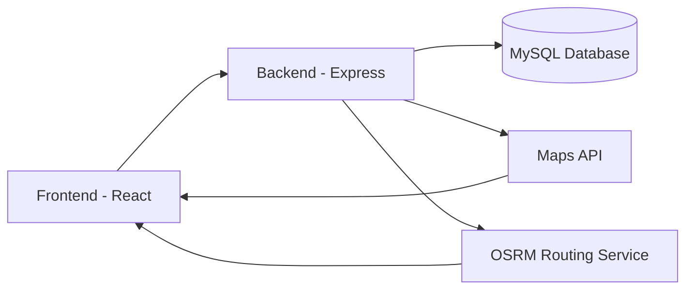

# EV Smart Assistant

<div align="center">
  
  <h1>⚡ EV Smart Assistant</h1>
  <p><b>Your Intelligent Companion for Seamless Electric Vehicle Travel</b></p>

  <p>
    <a href="https://evassist.vercel.app"><strong>Explore the Live Site »</strong></a>
    <br />
    <br />
    
    
    
    
  </p>
</div>

---

## 📖 Project Overview

**EV Smart Assistant** is a full-stack, enterprise-grade platform designed to eliminate "range anxiety" for Electric Vehicle (EV) owners. By integrating real-time mapping data with smart routing algorithms, the platform provides a comprehensive suite of services ranging from locating the nearest charging stations to optimizing long-distance travel routes.

Built with a focus on high performance and user experience, it serves as a bridge between EV hardware and the digital ecosystem, ensuring every journey is efficient, predictable, and stress-free.

### 🌟 Why This Project Matters
The global shift towards sustainable transport is often hindered by the lack of reliable infrastructure visibility. **EV Smart Assistant** addresses this by providing a unified interface that consolidates fragmented charging station data and combines it with advanced navigation, making EVs a viable choice for everyone, not just tech enthusiasts.

---

## 🚀 Key Features

| Feature | Description |
| :--- | :--- |
| **🔍 Smart Charging Search** | Locate stations near you with filters for connector types and availability. |
| **🗺️ Route Optimization** | Calculate the most energy-efficient paths using OSRM routing engine. |
| **📍 Interactive Maps** | High-fidelity map visualization powered by Maps API for real-time tracking. |
| **👤 User Authentication** | Secure profile management and personalized journey history. |
| **🛣️ Travel Support** | Intelligent recommendations for stops and nearby amenities during charging. |
| **📱 Responsive Design** | Seamless experience across Mobile, Tablet, and Desktop devices. |

---

## 🛠️ Tech Stack

### Frontend
[](https://reactjs.org/)
[](https://developer.mozilla.org/en-US/docs/Web/JavaScript)
[](https://developer.mozilla.org/en-US/docs/Web/Guide/HTML/HTML5)
[](https://developer.mozilla.org/en-US/docs/Web/CSS)

### Backend & Database
[](https://nodejs.org/)
[](https://expressjs.com/)
[](https://www.mysql.com/)

### APIs & Services
- **Maps API**: Core geospatial visualization and geolocation services.
- **OSRM (Open Source Routing Machine)**: High-performance routing engine for pathfinding.

---

## 🏗️ Architecture & Workflow

### API Workflow
1. **Request**: User inputs destination or requests nearby stations.
2. **Geocoding**: Maps API converts addresses to coordinates.
3. **Routing**: OSRM calculates the optimal path considering station proximity.
4. **Data Sync**: Backend queries MySQL for verified station metadata (pricing, ports).
5. **Render**: Frontend displays the layer-based map with interactive markers.


```mermaid
graph LR
  A[Frontend - React] --> B[Backend - Express]
  B --> C[(MySQL Database)]
  B --> D[Maps API]
  B --> E[OSRM Routing Service]
  D --> A
  E --> A
```

---

## 💡 Real World Use Case
**The "Weekend Explorer" Scenario:**  
Imagine a user planning a 300km trip from the city to a remote hillside. Their EV range is 220km. 
1. The user enters their destination in **EV Smart Assistant**.
2. The app identifies that the range is insufficient.
3. It automatically suggests two high-speed charging stops midway, integrated into the navigation.
4. The user arrives safely without ever worrying about their battery level.

---

## 🧠 Challenges Solved
- **Asynchronous Data Handling**: Synchronizing multi-source API responses (Maps + OSRM + Database) without blocking the UI main thread.
- **Geospatial Queries**: Implementing efficient SQL queries to find stations within a specific radius using the Haversine formula.
- **Complex Routing**: Customizing OSRM parameters to favor routes with higher station density.

---

## 📂 Folder Structure

```text
EV-Smart-Assistant/
├── client/                 # React Frontend
│   ├── public/             # Static assets
│   └── src/
│       ├── components/     # Reusable UI components
│       ├── pages/          # Full page views
│       └── utils/          # API helpers and constants
├── server/                 # Node/Express Backend
│   ├── config/             # DB and API configurations
│   ├── controllers/        # Request logic
│   ├── routes/             # API endpoints
│   └── models/             # MySQL schema definitions
├── .env.example            # Environment variables template
└── README.md
```

---

## 🛠️ Installation & Setup

### Prerequisites
- Node.js (v16+)
- MySQL Server
- API Key for Maps Service

### 1. Clone the Repository
```bash
git clone https://github.com/Jeetbaraiya/EV-Smart-Assistant.git
cd EV-Smart-Assistant
```

### 2. Backend Setup
```bash
cd server
npm install
# Create .env file based on .env.example
npm start
```

### 3. Frontend Setup
```bash
cd client
npm install
npm start
```

---

## 🔐 Environment Variables

Create a `.env` file in the root of both `client` and `server` folders:

| Variable | Description |
| :--- | :--- |
| `DB_HOST` | MySQL database host |
| `DB_USER` | MySQL database username |
| `DB_PASS` | MySQL database password |
| `MAPS_API_KEY` | Your Google/Leaflet Maps API Key |
| `OSRM_BASE_URL` | Endpoint for OSRM service |
| `JWT_SECRET` | Secret key for user sessions |

---

## 📸 Screenshots
<div align="center">
  <p><i>Dashboard & Map View (Placeholder)</i></p>
  
  <p><i>Route Optimization Interface (Placeholder)</i></p>
  
</div>

---

## 🚢 Deployment

### Vercel (Frontend)
1. Push your code to GitHub.
2. Connect your repo to [Vercel](https://vercel.com).
3. Set the `Build Command` to `npm run build` and `Output Directory` to `dist` or `build`.
4. Add your Environment Variables in the Vercel dashboard.

### Backend
The backend can be deployed on **Render** or **Heroku** with a managed MySQL instance (like Aiven or PlanetScale).

---

## 🧪 Testing
```bash
# Run backend tests
npm test --prefix server

# Run frontend tests
npm test --prefix client
```

---

## 🤝 Contributing
Contributions are what make the open-source community such an amazing place to learn, inspire, and create. Any contributions you make are **greatly appreciated**.

1. Fork the Project
2. Create your Feature Branch (`git checkout -b feature/AmazingFeature`)
3. Commit your Changes (`git commit -m 'Add some AmazingFeature'`)
4. Push to the Branch (`git push origin feature/AmazingFeature`)
5. Open a Pull Request

---

## 👨‍💻 Developer
**Jeet Baraiya**  
- GitHub: [@Jeetbaraiya](https://github.com/Jeetbaraiya)
- Portfolio: [jeetbaraiya.com](https://jeetbaraiya.com)

---

## 📜 License
Distributed under the MIT License. See `LICENSE` for more information.

<div align="center">
  <p>Made with ❤️ for a Greener Future</p>
</div>
